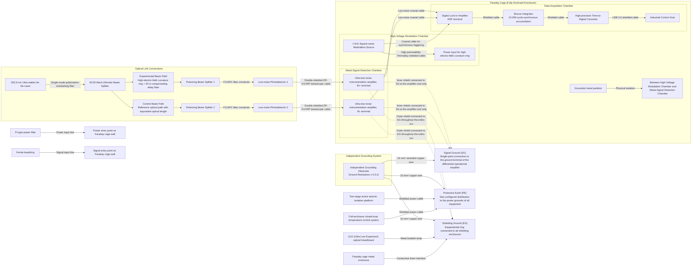

```mermaid
flowchart LR
    %% Global Grounding System
    subgraph GND["Independent Grounding System"]
        Z["Independent Grounding Electrode<br/>Ground Resistance ≤ 0.5 Ω"]
    end

    Z -- "16 mm² stranded copper wire" --> SG["Signal Ground (SG)<br/>Single-point connection to the ground terminal of the differential operational amplifier"]
    Z -- "10 mm² copper wire" --> PE["Protective Earth (PE)<br/>Star-configured distribution to the power grounds of all equipment"]
    Z -- "10 mm² copper wire" --> EG["Shielding Ground (EG)<br/>Equipotential ring connected to all shielding enclosures"]

    %% Optical Link Connections
    subgraph Optics["Optical Link Connections"]
        direction LR
        A["632.8 nm Ultra-stable He-Ne Laser"]
        B["50:50 Mach-Zehnder Beam Splitter"]
        C["Experimental Beam Path<br/>High-electric-field curvature ring + 30 m compensating delay fiber"]
        D["Control Beam Path<br/>Reference optical path with equivalent optical length"]
        E["Polarizing Beam Splitter 1"]
        F["Polarizing Beam Splitter 2"]
        G["Low-noise Photodetector 1"]
        H["Low-noise Photodetector 2"]
    end

    A -- "Single-mode polarization-maintaining fiber" --> B
    B --> C
    B --> D
    C --> E
    D --> F
    E -- "FC/APC fiber connector" --> G
    F -- "FC/APC fiber connector" --> H

    %% Weak-signal Differential Link Connections
    N["Ultra-low-noise instrumentation amplifier, IN+ terminal"]
    N2["Ultra-low-noise instrumentation amplifier, IN- terminal"]

    G -- "Double-shielded ZR-KVVRP twisted-pair cable" --> N
    H -- "Double-shielded ZR-KVVRP twisted-pair cable" --> N2

    N -. "Inner shield connected to SG at the amplifier end only" .-> SG
    N2 -. "Inner shield connected to SG at the amplifier end only" .-> SG
    N -. "Outer shield connected to EG throughout the entire run" .-> EG
    N2 -. "Outer shield connected to EG throughout the entire run" .-> EG

    %% Modulation and Signal Processing Link Connections
    Q["1 kHz Square-wave Modulation Source"]
    FQ["Power input for high-electric-field curvature ring"]
    J["Digital Lock-in Amplifier<br/>REF terminal"]
    K["Boxcar Integrator<br/>10,000-cycle synchronous accumulation"]
    L["High-precision Time-to-Digital Converter"]
    M["Industrial Control Host"]

    Q -- "High-permeability Permalloy-shielded cable" --> FQ
    Q -- "Coaxial cable for synchronous triggering" --> J
    N -- "Low-noise coaxial cable" --> J
    N2 -- "Low-noise coaxial cable" --> J
    J -- "Shielded cable" --> K
    K -- "Shielded cable" --> L
    L -- "USB 3.0 shielded cable" --> M

    %% Environmental Isolation System Wiring
    O["Two-stage active seismic isolation platform"]
    T["Full-enclosure closed-loop temperature control system"]
    S["ULE (Ultra-Low Expansion) optical breadboard"]
    FC["Faraday cage metal enclosure"]

    O -- "Shielded power cable" --> PE
    T -- "Shielded power cable" --> PE
    S -- "Metal braided strap" --> EG
    FC -- "Conductive foam interface" --> EG

    %% Feedthrough Filtering
    U["Pi-type power filter"]
    V["Ferrite bead/ring"]
    PEP["Power entry point on Faraday cage wall"]
    SEP["Signal entry point on Faraday cage wall"]

    U -- "Power input line" --> PEP
    V -- "Signal input line" --> SEP

    %% Faraday cage layout
    subgraph FaradayCage["Faraday Cage (Fully Enclosed Enclosure)"]
        direction TB

        subgraph HV["High-Voltage Modulation Chamber"]
            Q
            FQ
        end

        subgraph WeakSig["Weak-Signal Detection Chamber"]
            A
            B
            C
            D
            E
            F
            G
            H
            N
            N2
        end

        subgraph DataAcq["Data Acquisition Chamber"]
            J
            K
            L
            M
        end

        W["Grounded metal partition"]
        X["Between High-Voltage Modulation Chamber and Weak-Signal Detection Chamber"]
        W -- "Physical isolation" --> X
    end
```
```
