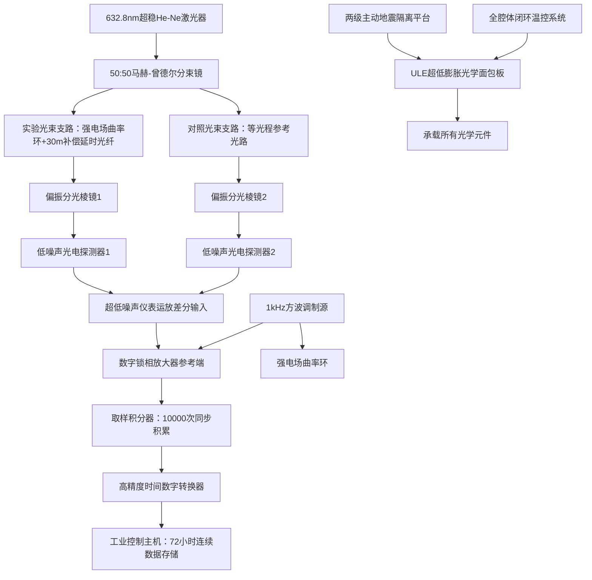

```mermaid
graph TD
    A[632.8nm超稳He-Ne激光器] --> B[50:50马赫-曾德尔分束镜]
    B --> C[实验光束支路：强电场曲率环+30m补偿延时光纤]
    B --> D[对照光束支路：等光程参考光路]
    C --> E[偏振分光棱镜1]
    D --> F[偏振分光棱镜2]
    E --> G[低噪声光电探测器1]
    F --> H[低噪声光电探测器2]
    G --> I[超低噪声仪表运放差分输入]
    H --> I
    I --> J[数字锁相放大器：1kHz调制参考同源]
    J --> K[取样积分器：10000次同步积累]
    K --> L[高精度时间数字转换器]
    L --> M[工业控制主机：72小时连续数据存储]
    N[两级主动地震隔离平台] --> O[ULE超低膨胀光学面包板]
    P[全腔体闭环温控系统] --> O
    O --> 承载所有光学元件
    Q[1kHz方波调制源] --> 强电场曲率环
    Q --> J[数字锁相放大器参考端]
```
